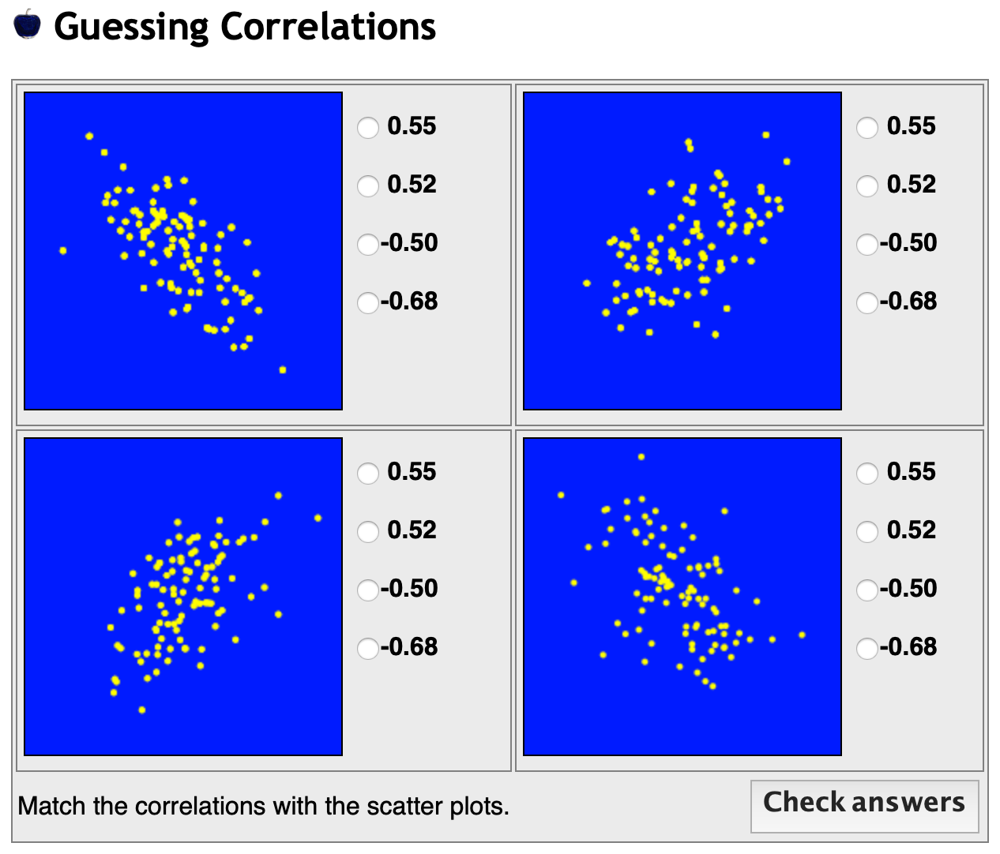
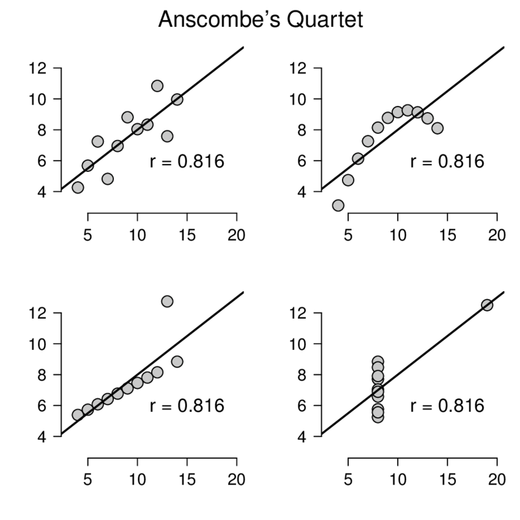

#### Today's agenda (5 min):  

- Q&A/vocabulary list

- Group Discussion

- Work on Project (if time)

- Writing prompt

#### This Week's Vocab (15-20 min) : 

- Linear relationship
- Approximately linear
- Non-linear
- Correlation
- Slope
- Intercept
- (Simple) linear regression
- Regression model
- Parameter
- Regression coefficients
- Fitted regression line
- Explanatory/independent variable
- Dependent variable
- Measure of model fit
- Coefficient of determination
- Error
- Residual
- Least-squares
- Least-squares estimator

#### Discussion (30 min) : 

- What are the assumptions of linear regression?

$y_i \sim N(\beta_0+\beta_1 x_i, \sigma^2)$

(This entails *normality, homoskedasticity, independence*, and *linearity* assumptions.)
<!--   - There must be a linear relationship between the outcome variable and the independent variables. Scatterplots can show whether there is a linear or curvilinear relationship. -->
<!--   - Multivariate Normality–Multiple regression assumes that the residuals are normally distributed. (More on this next week) -->
<!--   - No (or little) Multicollinearity—Multiple regression assumes that the independent variables are not highly correlated with each other.  This assumption is tested using Variance Inflation Factor (VIF) values. (more on this next week) -->
<!--   - Homoscedasticity–This assumption states that the variance of error terms are similar across the values of the independent variables.  A plot of standardized residuals versus predicted values can show whether points are equally distributed across all values of the independent variables. -->


- Can you guess which plot corresponds to which correlation coefficient?
```{r plot1, echo=FALSE, fig.align='center', out.width = "70%"}


```   


- x is more strongly associated with y in which plot? 
```{r plot2, echo=FALSE, fig.align='center', out.width = "70%"}


```   
(The correlation r ONLY describes the linear association between two numerical variables. the importance of plotting data to confirm the validity of the model fit.)


-	Discussion: Starbucks questions a-c
    - Describe your plot produced in question 1a. Make sure to note the x- and y-axis and to describe the association you observe, if any. E.g. the association linear, positive, negative, strong, weak, etc.?
    - What is the correlation between carbohydrates and calories weight? Make sure to explain how you calculated this value and what it means; i.e., provide an interpretation of the value.
    - Does this make sense based on your prior expectations? Are there any other variables you think may be important factors influencing the calories in a Starbucks food item?
    - Do there appear to be many outliers? Why might this matter?
  
$~$  

- Discussion: Starbucks questions d-f

  - Provide a simple linear regression equation for the association between calories and carbohydrates. Explain what each part of the model means in lay terms.
  - Based on your answer to part e, report the estimated values of your model and provide an interpretation of these values.  
  - How well does your model fit the data? Explain what the coefficient of determination means and provide an interpretation. 

#### Work on project (25-30 min) : 

\newpage
#### Writing prompt (30 min) :  

 
You have just been hired as the first statistician for a start up company that makes side walk chalk. Congratulations! You were hired because the owners are looking to add more credibility to their work by testing if their side walk chalk is significantly better than their competitors. This is based on whether children enjoy their free time more with their side walk chalk or their major competitor's (Mr. Bingbong). Each child enrolled in the study received either their side walk chalk or one from their major competitor. An adult in the household reported how much enjoyment their children got from playing with the chalk on a scale from 1 to 100. 

The big boss at your company (Sunny Lang) has heard about how her competitors using linear regression for their own studies and wants you to use the same. However, the Sunny does not actually know what linear regression is. Therefore, you need to craft an email explaining to Miss Lang what linear regression is, and whether it would be appropriate to use it for the proposed analysis. You should write out a hypothetical linear regression equation for the experiment and define what each part of the equation is in simple terms. Make sure to use a minimum of 2 vocabulary words and define the words for a nonstatistical audience. 


## Some things to keep in mind  

- Try to not spend more than 20 minutes on the prompt.    

- Aim for more than 200 but less than 400 words.    

- Use full sentences.    

- Grammar is not the main focus of the assessment, but it is important that you communicate in a clear and professional manner (i.e., no slang or emojis should appear). 

- Be specific. A good principle when responding to a prompt in STA130 is to assume that your audience is not aware of the subject matter (or in this case has not read the prompt).  


## Vocabulary  

Linear relationship 
- Approximately linear 
- Non-linear 
- Correlation 
- Slope 
- Intercept 
- (Simple) linear regression 
- Regression model 
- Parameter 
- Regression coefficients 
- Fitted regression line 
- Explanatory/independent variable 
- Dependent variable 
- Measure of model fit 
- Coefficient of determination 
- Error 
- Residual 
- Least-squares 
- Least-squares estimator
